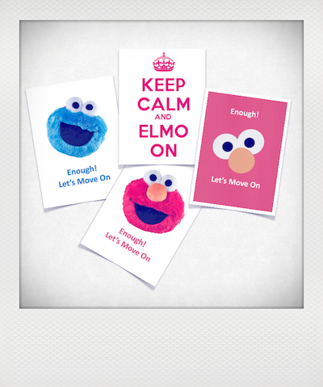
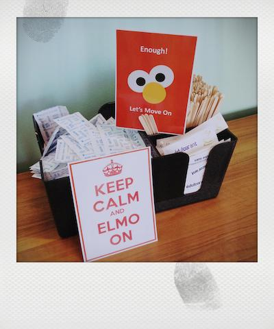
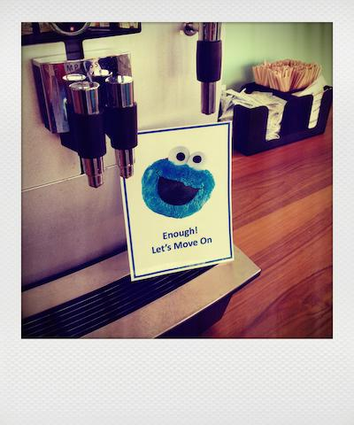
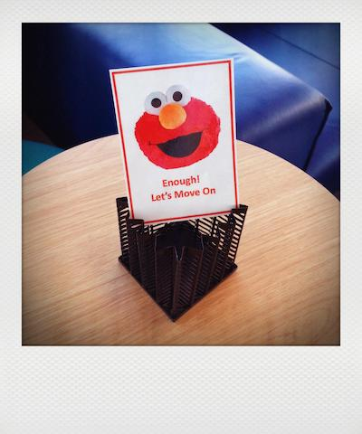

# ELMO

“**E**nough! **L**et’s **M**ove **O**n” Everyone has been in a meeting where someone went on too long and it was difficult to interrupt. An ELMO card is a friendly, visual sign that shows you get the point and are ready to move on. This is a great facilitation technique for any workshop or meeting, online and in person! 

