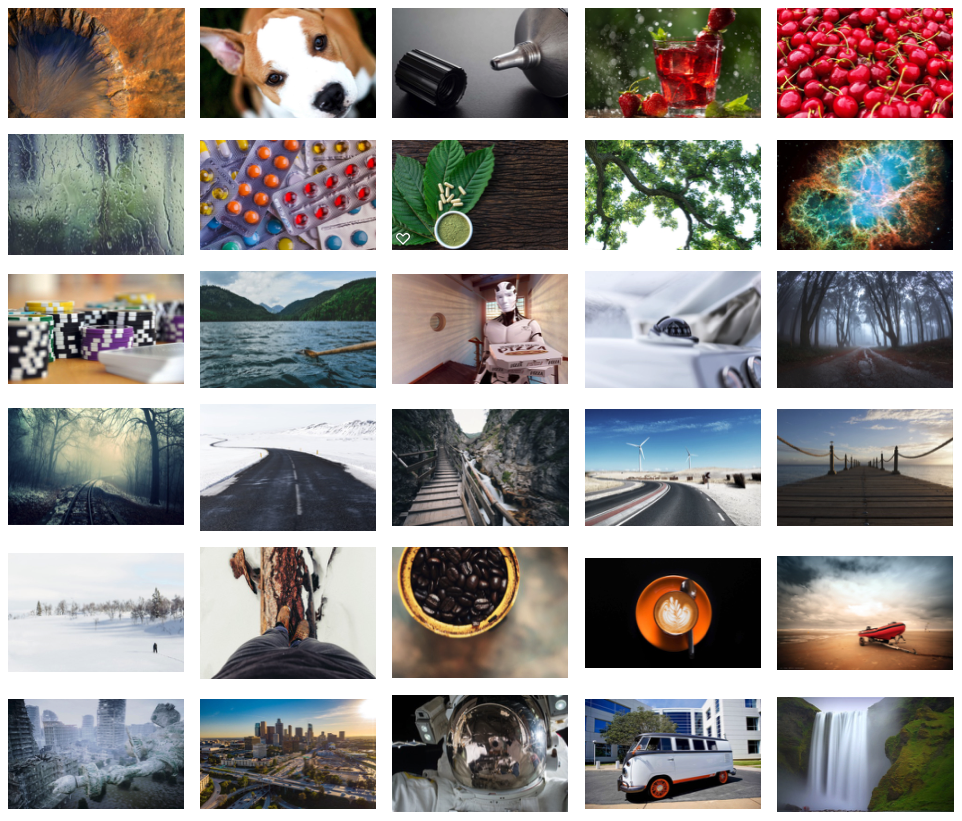
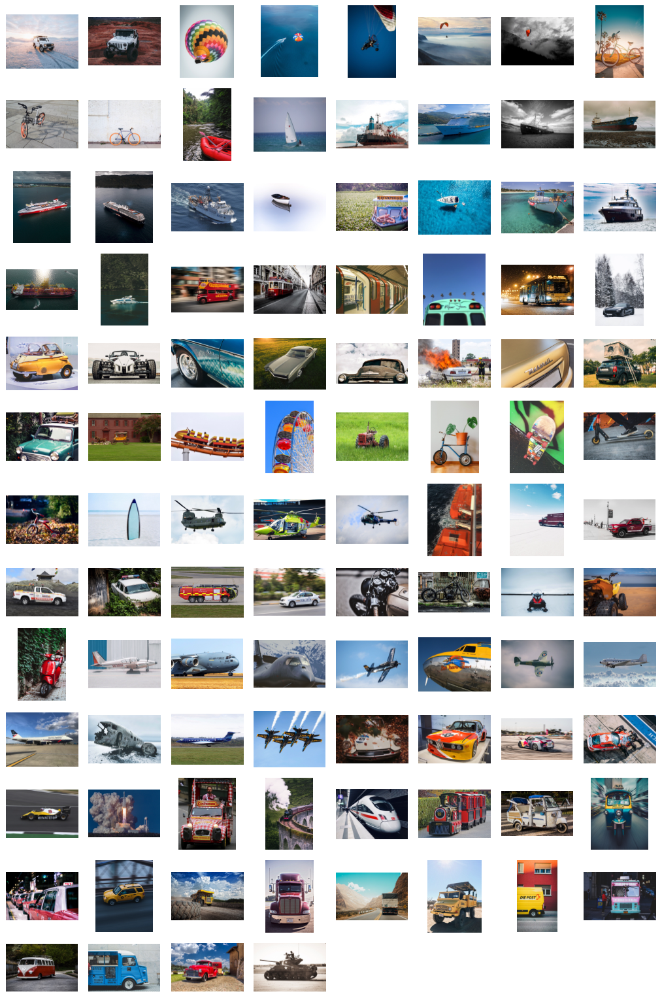

# Cartes de Photolangage 

Voila de quoi étoffer un kit de facilitation, avec des photos, classées en 3 dossiers:
- les originales, pour permettre d'autres assemblages 
- la version pour impression, avec un regroupement de 4 photos par page A4
- la version "vignettes", pour un éventuel affichage en ligne 

[C'est quoi au fait le photolangage?](https://www.youtube.com/watch?v=ykwarlNm_Ig#t=18s)

Le résultat après impression sur papier épais de 250g et découpage manuel, coins inclus.

### 30 cartes 

Un premier jeu, très utile pour des sessions d'awareness sur le photoloangage. 
Les photos sont extraites de mon navigateur après une séance de surf ...

### 100 cartes 

Un jeu beaucoup plus complet, centré sur les objets issus du monde des transports.
Les photos proviennent du site [unsplash](https://unsplash.com/), une mine d'or.

"Picturetelling is a creative method used to work with groups. The intention is to explore by means of explaining, communicating and telling a story based on a picture.The advantage of this method lies within the picture taking over the role of a mediator. The picture is part of the description and not the person him or herself. This enables the narrator to talk about personal issues without feeling exposed."

- What is my role in the team? 
- What are my strengths?
- What would I like to achieve in this seminar? 
- What could keep me from achieving it?
- What are my strengths? 
- What do I need help with?
- How do I feel in this team? 
- What would help me to feel better?