# Agile Bundle

Un set de posters et de cartes incontournables de l'agilité ... 

C'est ici et nulle part ailleurs.

Des PNGs prêts à imprimer, et à plastifier si nécessaire. 
Et le PPTX original, pour des customisations éventuelles.

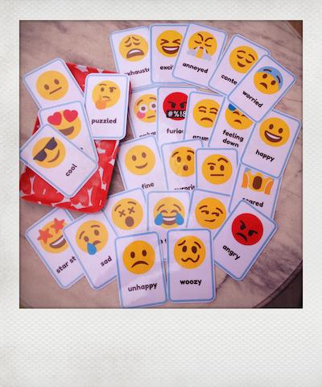

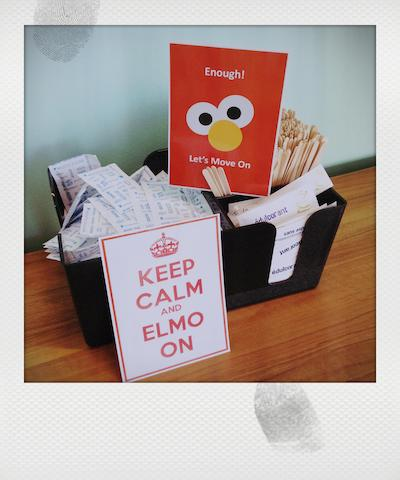

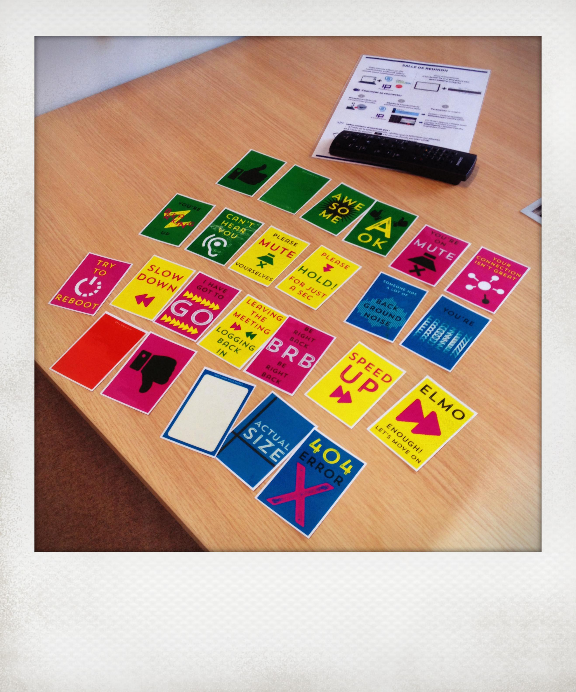

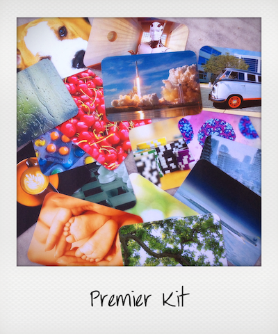
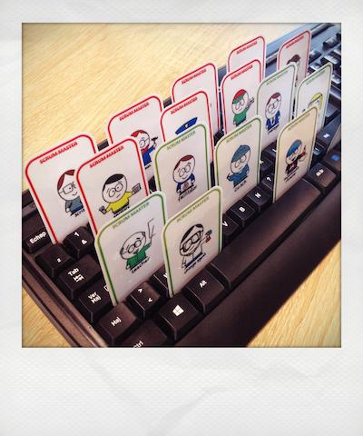

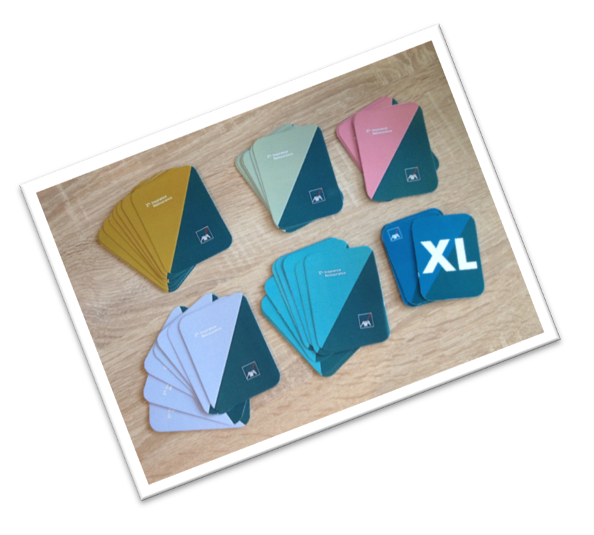

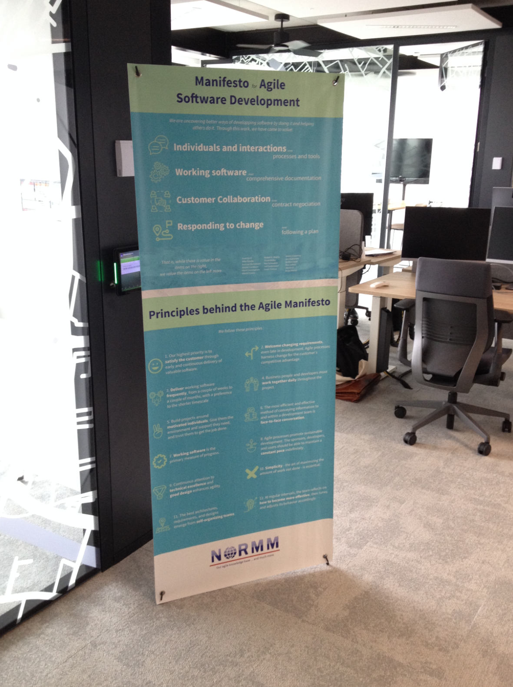
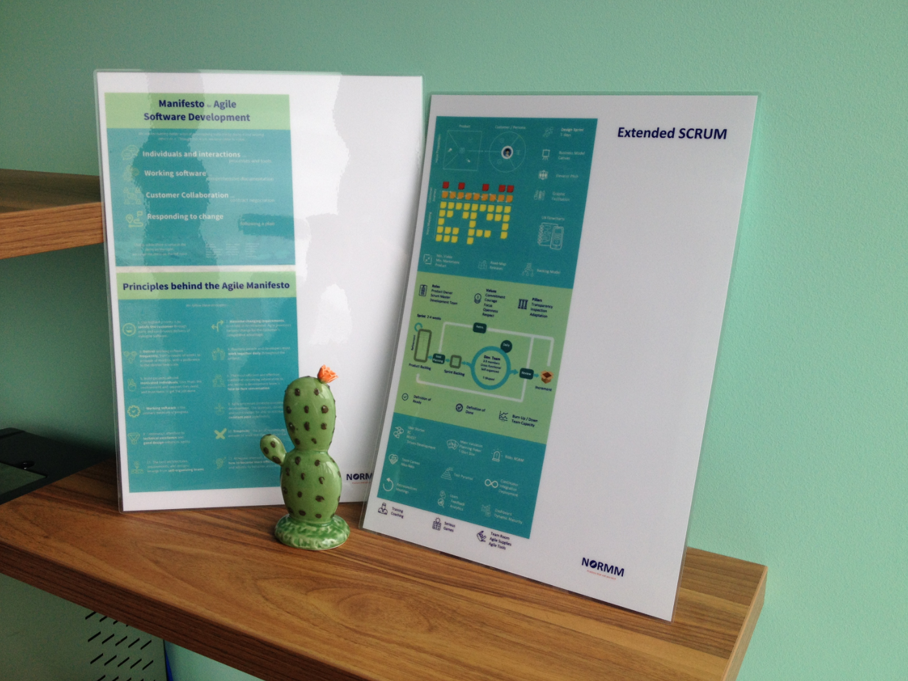
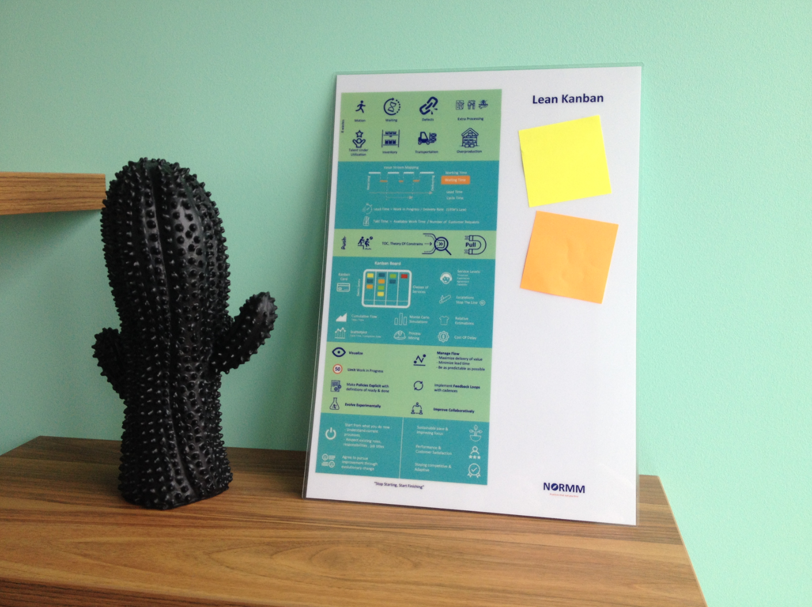

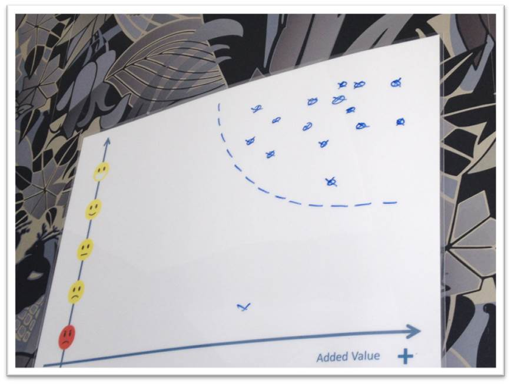
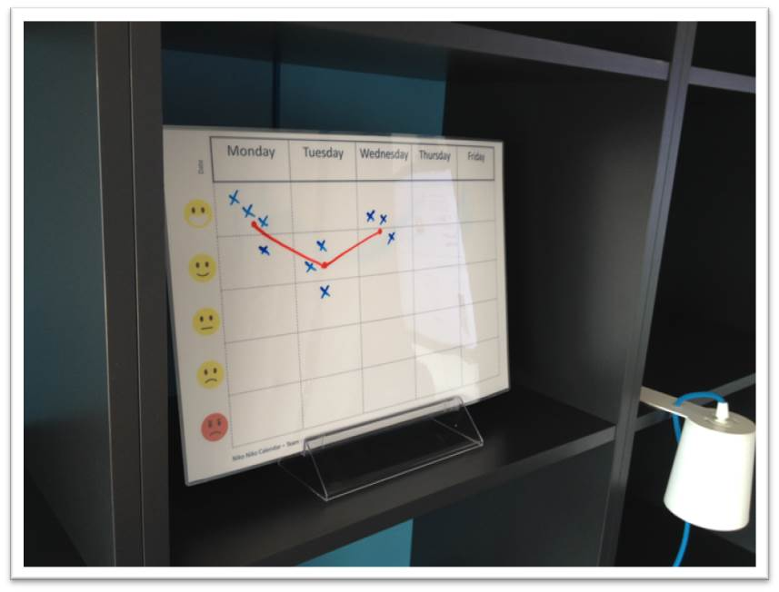
