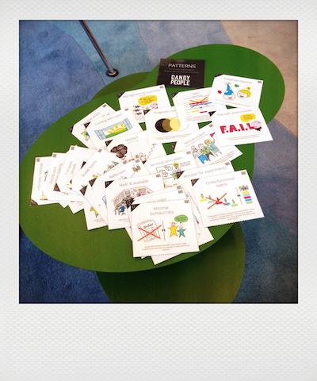

# LINKS

Jimmy Janlen : [Agile Topics card deck](https://blog.crisp.se/2015/10/08/jimmyjanlen/agile-topics-card-deck)

Dandy People : [Agile Infographic Posters Collection]( https://dandypeople.com/blog/agile-explained-infographic-posters-collection/)

Dandy People : [Agile Pattern Cards](https://media.dandypeople.com/2018/02/free-Pattern-Cards-Print-2018.pdf)

[101 inspiring quotes about agile from Mountain Goat](https://www.mountaingoatsoftware.com/email-tips)

[Quotes/Posters from Board of Innovation](https://www.boardofinnovation.com/tools/innovation-posters/)

 

Scrum Poster from [Softhouse](https://www.softhouse.se/publikationer/)

[UX Cards from UXREPUBLIC ](https://www.ux-republic.com/boutique/)

[UX Flowcharts Cards](https://www.uxflowcharts.com/)

[Laws of UX](https://lawsofux.com/)

Mieux travailler ensemble, [52 cartes pour dénouer les conflits](http://www.outilsetpratiquedelamediation.com/?page_id=6812)

Board Of Innovation : [52 brainstorm cards](https://www.boardofinnovation.com/tools/brainstorm-cards/)

[Kudo Cards](https://management30.com/shop/kudo-cards/) from Management 3.0